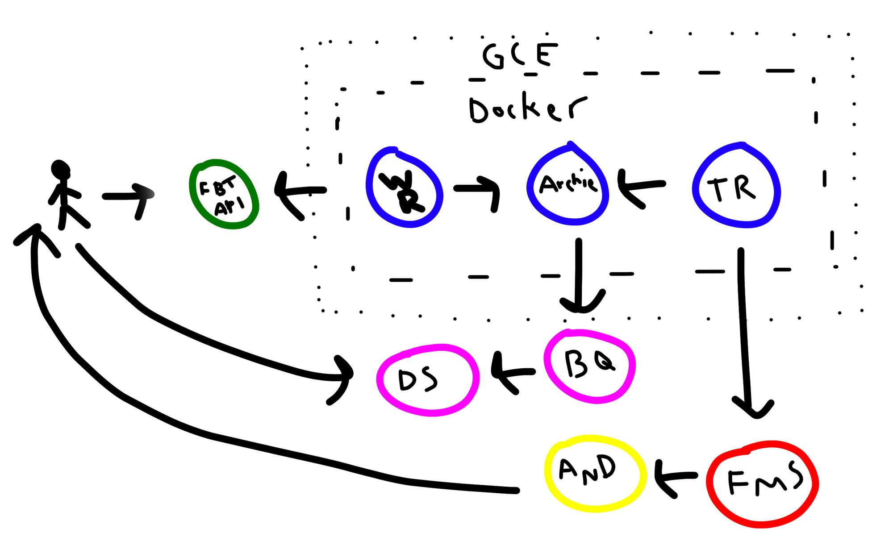

# Team Aqua: An overcomplicated system to remind me to drink water

Water. Agua. H2O. The elixir of life. The envy of the other planets.

Yet as essential this divine liquid is to us humans, we, and by we I mean I, usually forget to consume it. At the time of writing, I’m backpacking through Asia. Amid the excitement, enjoyment, and adventures of my new life, drinking water is a thought that barely crosses my mind. And when it does, I typically disregard it telling myself, “Nah, I’ll be fine. It’s just water. I’m not thirsty anyway.” But then, the night arrives, and in the winding down of what was another successful day, the headaches and tiredness come, reminding me that I should have refilled my bottle. Obviously, I had to find a solution.

As a data practitioner, of course the solution had to involve data. But I wanted more than that —  I wanted something exaggerated. My problem could have been easily solved by setting a timer or by downloading one of the many water-drinking-related apps. But no — again, I wanted more. Suddenly the problem became more a matter of how far can I take my solution than just reminding me to refresh my life a little. But a more realistic reason why I built this is because I honestly missed working with such a system. Back when I was employed, I used to deal with data, Golang, cloud, and production systems every single day. Now I don’t. So, I wanted to put together a system, where I could use all these tools.

My over-complicated platform, which I named Team Aqua after the famous Pokemon villainous team who wanted to expand the sea, destroy all human civilization and return the world to its original state (Pokemon can be very, very violent), uses the following platforms/services/components:

- A Fitbit device
- Fitbit’s API
- One Python service
- Two Golang services
- gRPC (and thus, Protobufs)
- Firebase (Messaging Service)
- An Android app
- Docker
- Google Cloud’s Container Registry
- Google Cloud’s Compute Engine
- BigQuery
- Google’s Data Studio

## Overview

Before I start to explain each component, I want to give you a small recap showing the system’s architecture, all the moving pieces, and what they do. The beginning of this lovely tale takes place on my Fitbit watch (or app). Here, I’m going to entry each water session (let’s call it that), generating in the process the data the platform needs (that’s why I’m calling this a data-driven solution). After logging the water session, this data will be sent to Fitbit and stored there.

To retrieve this data, I have a Python service (called Water Retriever) that talks to Fitbit’s API every X minutes and gets all the water sessions I’ve logged today. Then, the Python client will communicate through gRPC, with the back-end (written in Golang), which I named Archie, after Team Aqua’s leader. Archie’s role is to keep the water sessions in memory and write them into BigQuery.

Besides Archie, there’s a second Golang component, called The Reminder. This little fella will ask Archie, every X minutes, for the amount of water I’ve consumed during that time. If I’ve consumed not a single drop of water during this time, it will send a notification to an Android app I wrote as part of the platform, reminding me that I haven’t had any water in the last X minutes. Otherwise, if I have hydrated myself, the notification will congratulate me, saying I’ve drink Y ml. of water in the last X minutes. The push notification is handled by Firebase Cloud Messaging.

The three services are contained in the same Docker image, which is hosted in Google Cloud’s Container Registry. Said image is executed on a “normal” Compute Engine machine (not a Kubernetes cluster, Cloud Run, or any of that fancy stuff). Lastly, to analyze the data, since it already resides in BigQuery, I just run a couple of queries and visualize them using Google’s Data Studio.

The following image is a chart of the complete architecture:

First, there’s me, logging the water data in Fitbit and sending it to their servers. Then, Water Retriever (WR) gathers this data and sends it to Archie, who keeps the data and writes a copy in BigQuery. Next to it, there’s The Reminder, who gets data from Archie and send a notification that ultimately is read by me.

In the route below Archie, there’s BigQuery, who provides data to Data Studio for me to analyze it.

For more information check out the blog post detailing the system at [Team Aqua]([https://link](https://wanderdata.com/water-platform/))

## The repo
This repo contains all the code behind the system. The root directory are the Golang packages. In *api/* you will find the gRPC server definition and in *endpoint/* the Golang code. In *water_retriever/* is the Water Retriever service, and in *android/* is the Android app.

